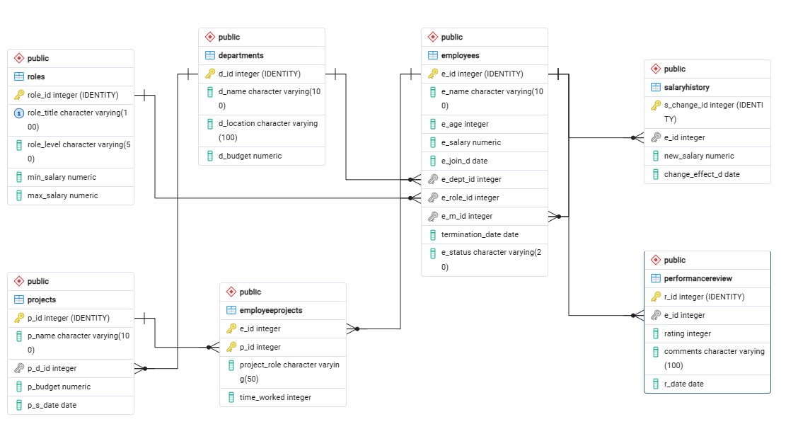

# Enterprise HR Analytics Platform

A PostgreSQL database schema designed for managing corporate HR data, organizational reporting hierarchies, project assignments, and historical compensation tracking.

## Entity Relationship Diagram

## Execution Order
To avoid foreign key dependency errors, execute the SQL files in this exact order in pgAdmin or psql

1. `Schema/01_departments_table.sql`
2. `Schema/02_projects_table.sql`
3. `Schema/03_roles_table.sql`
4. `Schema/04_employees_table.sql`
5. `Schema/05_employeeprojects_table.sql`
6. `Schema/06_salaryhistory_table.sql`

## Database Automation & Triggers
The schema includes PL/pgSQL triggers to maintain audit logs and automate updates:

1.**`new_employee_before_insert_trigger`** Validates salary amounts in employees is >= zero
  **`new_employee_after_insert_trigger`**  Automatically creates an initial joining salary in `salaryhistory` whenever a new employee is hired.
   
2. **`trigger_salary_change_entry`**
   * **Target:** `salaryhistory` table (`BEFORE INSERT`)
   * **Function:** Validates salary amounts is > zero, Automatically syncs new compensation back to the `employees` table, and prevents historical/backdated raise inserts from overwriting(updating) current employee salaries.
